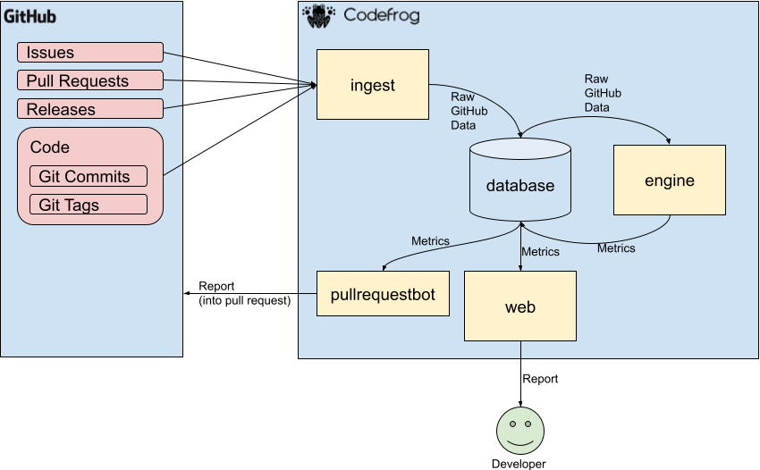

[](https://svgshare.com/i/Zhy.svg)
[](https://www.python.org/)
[](https://unmaintained.tech/)
[](https://codefrog.io/)
[](https://www.gnu.org/licenses/agpl-3.0.html)

## 

Engineering analytics for your software project. Minimize lead time. Manage your technical debt. Keep code quality high.

## Description

Connect your project on GitHub and get analytics about your code base for every pull request.

See:

- the hot spots on your code (where the most of your work is done)
- how the complexity of your code base evolves
- how the time from opening a pull request to merging it evolves

If you run Codefrog periodically you can work on the problem areas in your code and see how your team gets faster in delivering high quality code.

## System architecture



Whenever new code is pushed, Codefrog is notified by GitHub and ingests information about issues, pull requests, releases and the code itself (tags and of course commits) (see [core.models.Project.ingest()](https://github.com/antonpirker/codefrog/blob/master/codefrog/core/models.py#L170-L199))

The codefrog engine calculates now metrics from the raw data of GitHub. Metrics like:

- times it takes to close issues or pull requests,
- the complexity changes of every change in every file,
- the change frequency of every file,
- and more

After the metrics are calculated the user (developer or manager) can see the state of the code base and how it changed over time in the web interface.

There is also a thing called `pullrequestbot` then posts a short report directly into the pull request, so the developer sees immediatly the impact her code changes will have to the system.

## Development

The project assumes that you have a Postgres Database running on localhost port 5432.

- Move into directory:

  ```bash
  cd codefrog
  ```

- Create and virtual environement:

  ```bash
  python3 -m venv .env
  source .env/bin/activate
  ```

- Install requirements:

  ```bash
  pip install -r requirements.txt
  ```

- Create directory for storing git repos:

  ```bash
  sudo mkdir  ~/codefrog_projects_git_repos
  ```

- Move into project dir and start project
  ```bash
  cd codefrog
  export SECRET_KEY=something_secret
  ./manage.py runserver 0.0.0.0:8000
  ```

## Deployment

Every time new code is pushed to the repository the new code will build and tested and if everything is alright it will be deployed to production.

Deployment to production is only executed when the branch is called `master` or prefixed with `release/`.

Codefrog uses [Github Actions](https://github.com/features/actions) for this process. See [.github/workflows/deploy-to-production.yml](.github/workflows/deploy-to-production.yml)
